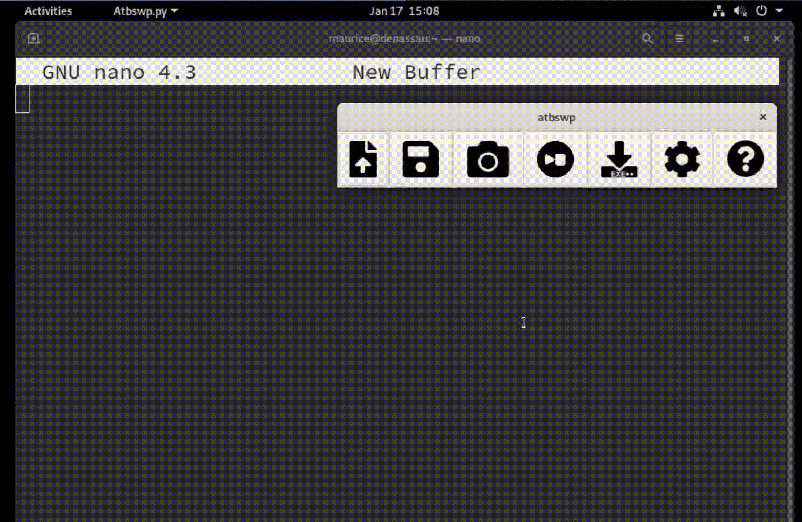

# Atbswp


Literally Automate the boring stuff with Python, allows the user to record his mouse and keyboard 
actions and reproduce them identically as many times as he wants.

# Install instructions
Fedora
```shell
git clone https://github.com/RMPR/atbswp.git && cd atbswp
sudo dnf install python3-wxpython4
make prepare-dev
make run
```
Debian
```shell
git clone https://github.com/RMPR/atbswp.git && cd atbswp
sudo apt install python3-wxgtk4.0
pip install -r requirements.txt
python atbswp/atbswp.py
```
Windows
```shell
git clone https://github.com/rmpr/atbswp
cd atbswp\
pip install wxPython 
pip install -r requirements-dev.txt
python atbswp\atbswp.py
```

# Demo



# Use cases
While I've mainly used it to automate my Asphalt runs, I think this can be far more useful:
- automate a demo during a conference for example
- automate UAT in the devops process (as long as you're making something with a GUI).

If you use it for something really cool you can always reach me at akoudanilo(at) gmail (dot) com or drop
a PR :). Bonus points if you have a demo video.
# Contributions
Contributions are welcomed, see [CONTRIBUTING.md](./CONTRIBUTING.md)

# Known issues
On Linux, this only works with Xorg, with wayland support coming soon, for now you have to
enable Xorg. 

```
sudo sed 's/#WaylandEnable=false/WaylandEnable=false/' /etc/gdm/custom.conf -i # on Gnome
```

# Join us
To keep up with the latest news about atbswp you can reach us on this [telegram channel](https://t.me/atbswp) we will
post important news and periodically runs polls to keep the users feedback.
